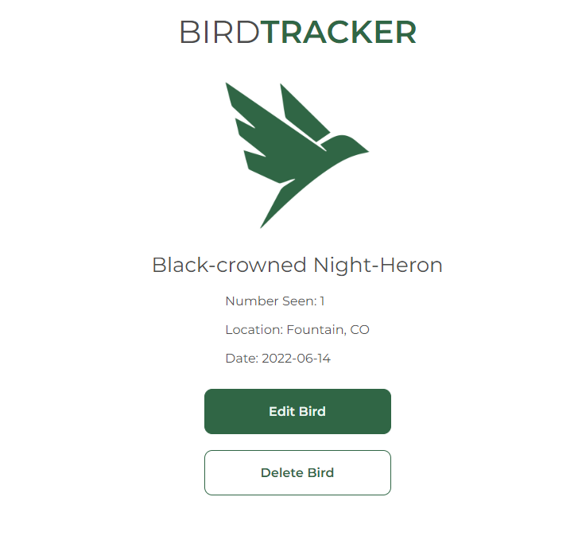

# BirdTracker

A simple full-stack CRUD application for keeping track of a birding list. Uses geolocation to determine user's location for simplified listing of new birds.

## Deploys

* [Deployed Site](https://bird-tracker.netlify.app)
* [Back-End Repository](https://github.com/jonalake/capstone-backend)

## Screenshots

